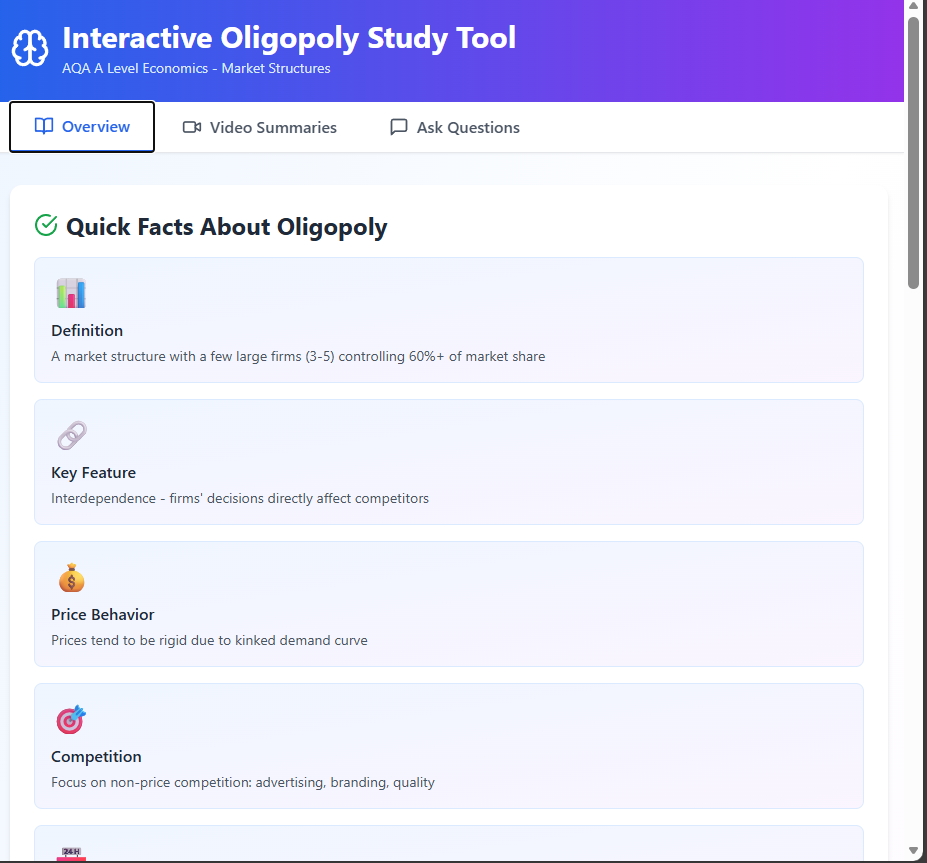
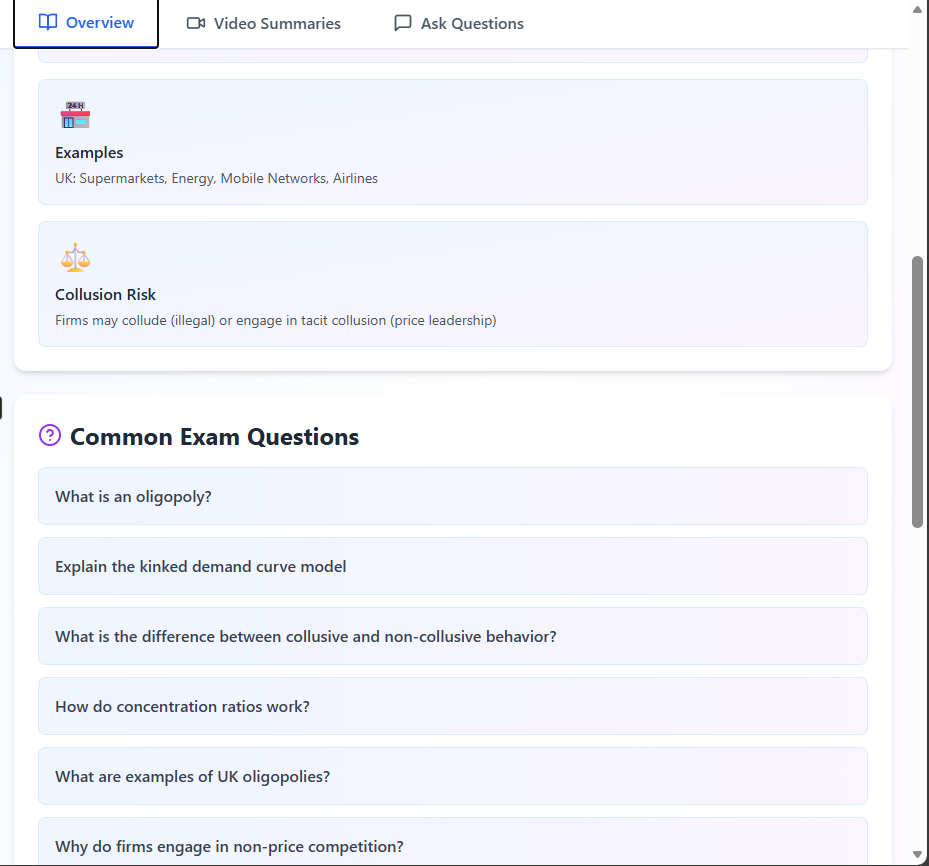
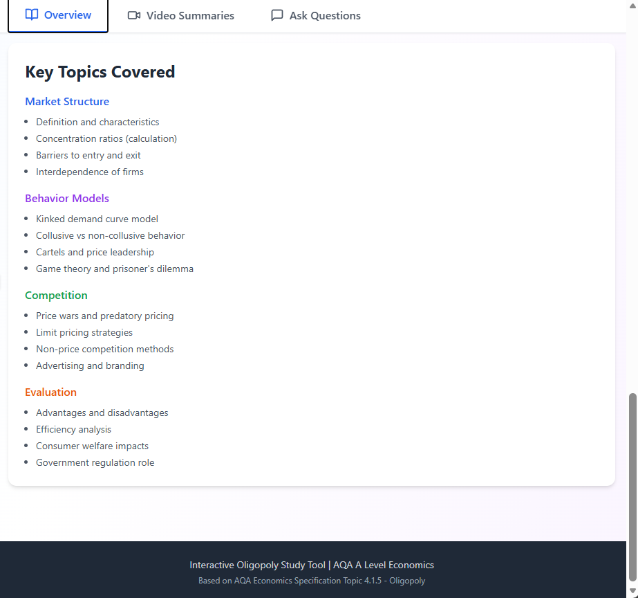
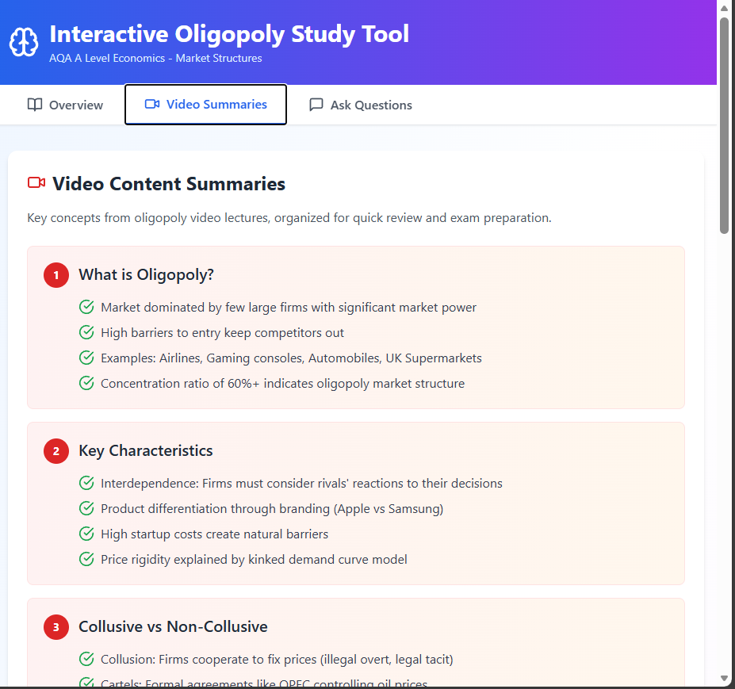
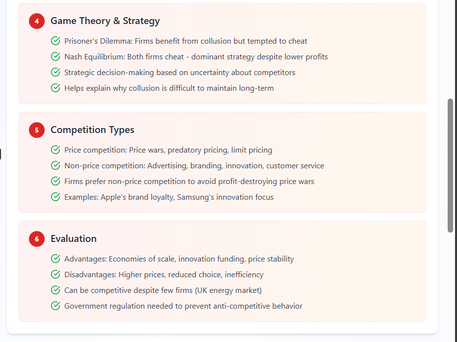
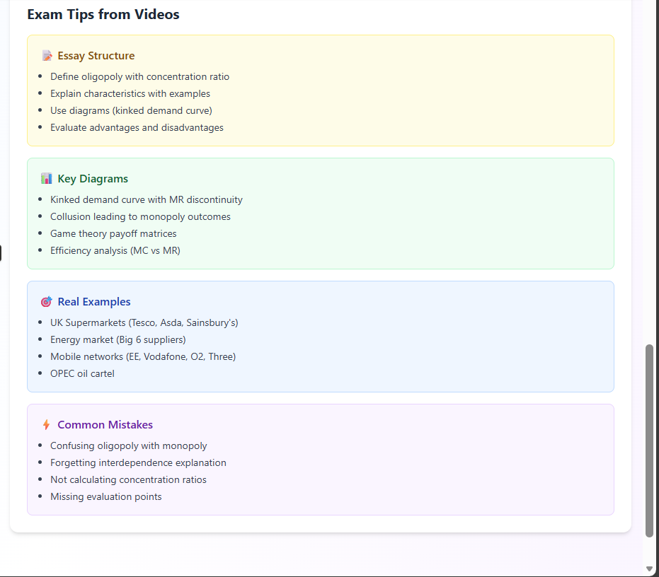
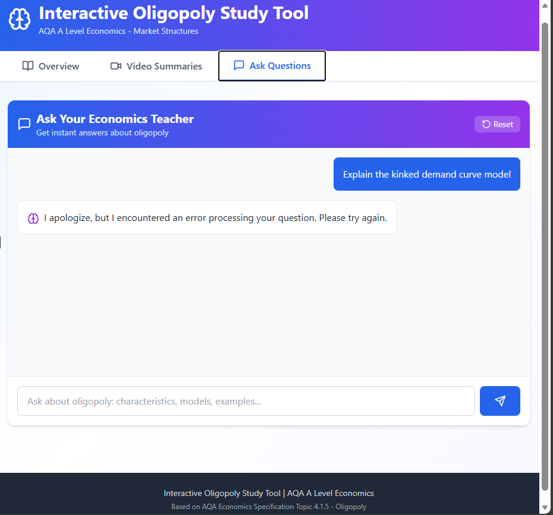

# Interactive Oligopoly Study Tool

📘 AQA A Level Economics – Market Structures (Oligopoly)

## Features
- Interactive theory overview
- Exam-focused quick facts
- Video summaries
- AI-powered Q&A chat
- Clean modern UI

## Tech Stack
- React
- Vite
- Lucide Icons

## Run Locally
```bash
npm install
npm run dev

Build
npm run build

Author

Sahil Pravin Burele

📄 License

This project is for educational use.

**ScreenShot**







---
